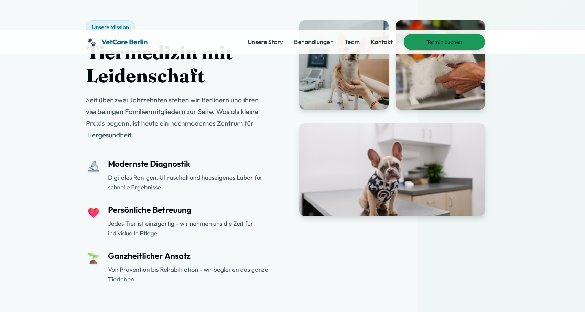

# VetCare Berlin - Modern Veterinary Practice Website

A fully responsive, modern website design for a fictional veterinary practice, showcasing advanced CSS techniques and contemporary web development practices.



## 🌟 Live Demo

[View Live Demo](https://vet-practice-demo.netlify.app/) | [View Code](https://github.com/leverh/tierarzt-praxis-7)

## 📋 Project Overview

This project demonstrates modern web development through a complete veterinary practice website. The design focuses on trust, professionalism, and user experience while incorporating new CSS features.

**⚠️ Disclaimer:** This is a portfolio demonstration. All content, services, and contact information are fictional.

## ✨ Key Features

### 🎨 Design & UX
- Clean design with professional color palette
- Navigation with smooth scrolling
- Responsive design
- Accessible and user-friendly interface

### 🛠️ Technical Highlights
- **CSS**: OKLCH color space, `color-mix()` functions
- **Container Queries**: Component-based responsive design
- **Fluid Typography**: `clamp()` functions for perfect scaling
- **CSS Grid**: Layouts with `auto-fit` and `minmax()`
- **Custom Properties**: Maintainable design system
- **Progressive Enhancement**: Works with or without JavaScript

### 📱 Responsive Features
- Hamburger navigation menu
- Touch-friendly interactions
- Scroll-to-top functionality

### ♿ Accessibility
- ARIA labels and semantic HTML
- Keyboard navigation support
- Focus management
- `prefers-reduced-motion` support
- High contrast mode compatibility
- Screen reader friendly

## 🚀 Technologies Used

- **HTML5**: Semantic markup
- **CSS3**: New features and methodologies
- **JavaScript**: Vanilla JS for interactions
- **Google Fonts**: Typography (Poppins + Fraunces)
- **Unsplash**: Stock photography

## 📂 Project Structure

```
tierarzt-praxis-7/
│
├── index.html              # Main HTML file
├── styles.css              # Complete stylesheet
├── script.js               # JavaScript functionality
├── assets/                 # Images and media
│   ├── perview.png
├── README.md               # Project documentation
```

## 🎯 Design Decisions

### Color Palette
- **Primary**: OKLCH blue (#4A90E2) - Trust and professionalism
- **Secondary**: OKLCH green (#67B26F) - Health and nature
- **Accent**: Warm orange - Call-to-action elements
- **Neutrals**: Sophisticated grays with slight blue tint

### Typography
- **Headers**: Fraunces (Modern serif for elegance)
- **Body**: Poppins (Clean sans-serif for readability)
- **Fluid scaling**: Responsive type that adapts to screen size

### Layout Philosophy
- **Card-based design**: Clear content boundaries
- **Generous whitespace**: Easy scanning and reading
- **Visual hierarchy**: Clear information architecture

## 🔧 Advanced CSS Techniques

### OKLCH Color Space
```css
--primary-500: oklch(0.65 0.13 210);
--success: color-mix(in oklch, var(--secondary-500) 85%, white 15%);
```

### Container Queries
```css
@container (max-width: 768px) {
    .hero { grid-template-columns: 1fr; }
}
```

### Fluid Typography
```css
--text-4xl: clamp(2.25rem, 4vw + 1.8rem, 3.5rem);
```

### Modern Grid Layouts
```css
.services-grid {
    display: grid;
    grid-template-columns: repeat(auto-fit, minmax(280px, 1fr));
}
```

## 📱 Responsive Breakpoints

- **Mobile**: < 768px
- **Tablet**: 768px - 1024px
- **Desktop**: > 1024px
- **Large Desktop**: > 1330px

## 🎨 Performance Optimizations

- **CSS Custom Properties**: Efficient styling system
- **Minimal JavaScript**: Vanilla JS, no frameworks
- **Optimized Images**: Proper sizing and lazy loading
- **Efficient Animations**: GPU-accelerated transforms
- **Progressive Enhancement**: Core functionality without JS

## 🌐 Browser Support

- **Modern Browsers**: Chrome 88+, Firefox 87+, Safari 14+
- **Graceful Degradation**: Fallbacks for older browsers
- **Container Queries**: Fallback to media queries
- **OKLCH Colors**: Fallback to standard colors

## 🚀 Getting Started

1. **Clone the repository**
   ```bash
   git clone https://github.com/leverh/tierarzt-praxis-7
   ```

2. **Navigate to project**
   ```bash
   cd tierarzt-praxis-7
   ```

3. **Open in browser**
   ```bash
   open index.html
   ```
   Or use a local server:
   ```bash
   python -m http.server 8000
   ```


## 📄 License

This project is licensed under the MIT License. Copy or share - I really don't care 🖖✌️

## 👨‍💻 About me

This project was created as part of my web development portfolio and to practice new CSS methodologies. I specialize in modern frontend development with a focus on accessibility, performance, and user experience.

**Connect with me:**
- [Portfolio Website](https://pixelsummit.dev/)
- [GitHub](https://github.com/leverh)

---

If you found this project helpful, please give it a ⭐ on GitHub! 